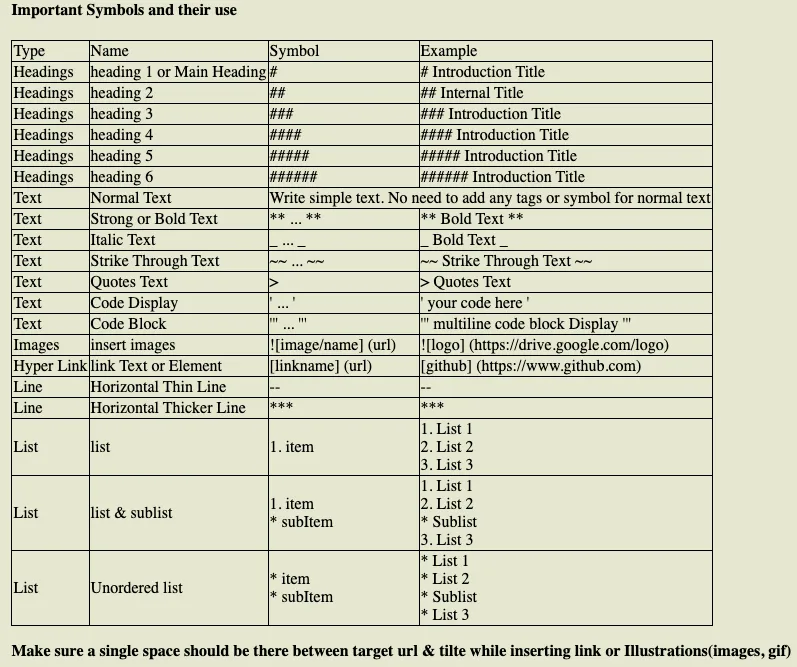
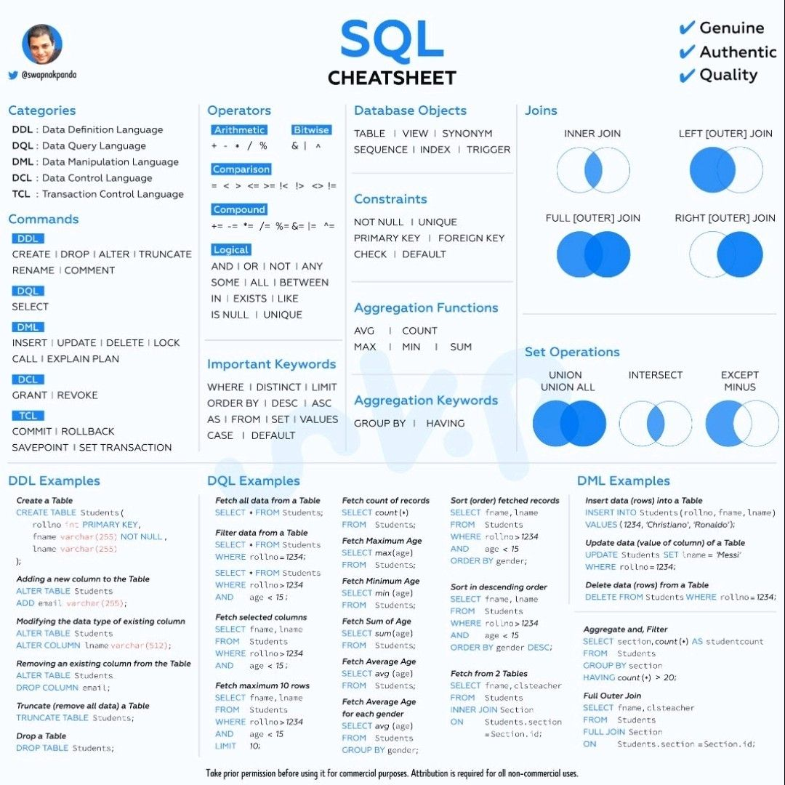
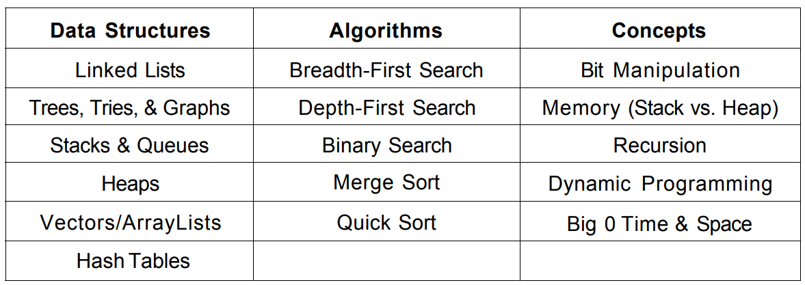

# **Leetcode** & **Data Structure** problem solution in _Python_.

### Important **symbols** & their uses to write a readme. md file.

 >

 

***

 

### All major programming languages have a built in method for sorting. It is usually correct to assume and say sorting costs O(n⋅logn), where n is the number of elements being sorted. For completeness, here is a chart that lists many common sorting algorithms and their completeness. The algorithm implemented by a programming language varies; for example, Python uses Timsort but in C++, the specific algorithm is not mandated and varies. 
 

  >

 

### SQL CheatSheet
>

### Must-Have for Coding interview
>

###### Note: All the content is mixture of my own understanding and the material I found online.  